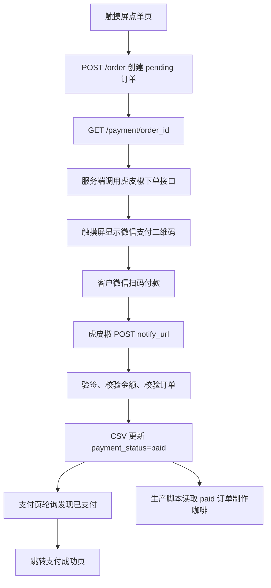

# 虎皮椒真实支付接入计划

## 现状判断

当前系统已经有真实支付需要的大部分骨架：

- [app.py](app.py) 的 `/order` 会创建本地订单并跳到 `/payment/<order_id>`。
- [order_db.py](order_db.py) 已有 `payment_status`、`payment_amount`、`payment_method`、`payment_time`、`payment_transaction_id` 字段，以及 `update_payment_status()`。
- [mainio_IN11_monitor.py](mainio_IN11_monitor.py) 不需要改：它只会处理 `payment_status == 'paid'` 且 `status == 0` 的 CSV 订单。
- [templates/payment.html](templates/payment.html) 现在是模拟二维码和“确认模拟支付”按钮，需要换成虎皮椒返回的真实二维码。

建议保留“下单先写入 CSV，但状态为 pending”的现有结构。这样订单号稳定、刷新页面不会丢单；真正进入制作队列仍然只发生在虎皮椒回调把订单改成 `paid` 之后。

## 支付流程

## 代码修改计划

1. 新增虎皮椒支付封装模块

- 新建 [hupijiao_pay.py](hupijiao_pay.py)，从 [hupijiao-v3-python.py](hupijiao-v3-python.py) 提取可复用逻辑。
- 不直接使用原 SDK 里的 `import config`，因为当前项目没有 `config.py`，而且密钥不应写死。
- 封装这些函数：
  - `sign(params, secret)`：按虎皮椒规则生成 MD5 签名。
  - `verify_sign(params, secret)`：回调验签。
  - `create_payment(order, return_url, callback_url)`：调用 `https://api.xunhupay.com/payment/do.html`。
  - `parse_trade_order_id()`：把虎皮椒商户订单号如 `coffee_12` 解析回本地 `order_id=12`。

1. 增加本地配置读取

- 在 [app.py](app.py) 或新模块中读取环境变量：
  - `XUNHUPAY_APPID`
  - `XUNHUPAY_APPSECRET`
  - `XUNHUPAY_GATEWAY`
  - `XUNHUPAY_PUBLIC_BASE_URL`
  - `XUNHUPAY_PAYMENT=wechat`
  - `XUNHUPAY_TITLE=领志科技咖啡`
- 你给的 Appid 和密钥建议放在本机 `.env` 或系统环境变量，不写入代码文件。
- 如果仓库还没有依赖清单，补一个 [requirements.txt](requirements.txt)，至少包含 Flask 已用依赖和虎皮椒需要的 `requests`；二维码如果直接用虎皮椒返回的二维码图片/URL，可以不在后端生成本地二维码。

1. 改造 [app.py](app.py) 支付路由

- 保留 `/order` 的创建订单逻辑，继续写入 pending 订单。
- 修改 `/payment/<order_id>`：
  - 读取订单。
  - 如果已支付，跳成功页。
  - 如果未支付，调用虎皮椒创建支付订单，拿到支付二维码 URL 或支付链接。
  - 渲染 [templates/payment.html](templates/payment.html)，传入 `pay_url` 或 `qr_url`。
- 新增 `/payment/callback/xunhupay`：
  - 接收虎皮椒 POST 回调。
  - 校验签名、`appid`、`status == OD`、订单号、金额。
  - 幂等处理：订单已是 `paid` 时直接返回 `success`。
  - 校验通过后调用 `order_db.update_payment_status(order_id, 'paid', 'xunhupay_wechat', transaction_id)`。
  - 返回纯文本 `success`，否则虎皮椒会重试。
- 生产环境禁用或隐藏 `/payment/confirm` 模拟支付，避免有人绕过真实付款把订单改成 paid。可以用环境变量 `ENABLE_SIMULATED_PAYMENT=false` 控制。
- `/api/payment/status/<order_id>` 可以继续复用，支付页面轮询它即可。

1. 改造 [templates/payment.html](templates/payment.html)

- 删除或隐藏模拟二维码和“确认模拟支付”按钮。
- 显示真实微信支付二维码：
  - 如果虎皮椒返回可直接展示的二维码图片地址，就用 `` 展示。
  - 如果只返回支付链接，就后端或前端生成二维码；优先后端生成一次性 base64 图片或引入轻量前端二维码库。
- 页面文案改成：`请使用微信扫码支付，支付成功后将自动进入制作队列`。
- 保留现有轮询逻辑：每 3 秒请求 `/api/payment/status/<order_id>`，发现 `paid` 后跳转 `/order/success?order_id=...`。
- 增加失败提示：虎皮椒创建支付失败时显示“二维码生成失败，请重新下单或联系工作人员”。

1. 小幅调整 [templates/success.html](templates/success.html) 和可选订单页

- 成功页继续显示订单号、杯数、金额、交易号、支付方式。
- 支付方式把 `xunhupay_wechat` 显示为“微信扫码支付”。
- [templates/orders.html](templates/orders.html) 如果当前展示模拟支付字样，也同步换成真实支付文案。

1. 保持生产脚本不变

- [mainio_IN11_monitor.py](mainio_IN11_monitor.py) 继续读取 CSV 中 `payment_status == 'paid'` 的订单。
- 因为回调只负责把订单从 pending 改 paid，所以不会影响机械臂、IO、咖啡机串口逻辑。

## 需要特别注意

- 虎皮椒回调地址必须是公网 HTTPS，例如 cpolar 域名：`https://xxxx.cpolar.top/payment/callback/xunhupay`。
- 触摸屏访问局域网 Flask 页面没问题，但虎皮椒服务器回调不能访问局域网 IP，必须走公网 HTTPS 转发。
- 回调必须验签和校验金额，不能收到回调就直接改 paid。
- 你已经在聊天里发过密钥，正式使用前最好在虎皮椒后台重新生成一次密钥，然后只放到本机环境变量里。

## 验收方式

- 本地启动 Flask，触摸屏提交 1 杯订单后能看到真实微信二维码。
- 手机微信扫码支付成功后，虎皮椒回调返回 `success`。
- [orders.csv](orders.csv) 中该订单从 `pending` 变为 `paid`，`payment_method=xunhupay_wechat`，写入交易号和支付时间。
- 支付页自动跳转成功页。
- 启动 [mainio_IN11_monitor.py](mainio_IN11_monitor.py) 后，咖啡制作流程只处理已支付订单。
- 访问或伪造未验签回调不会把订单改成 paid。
