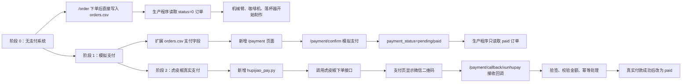
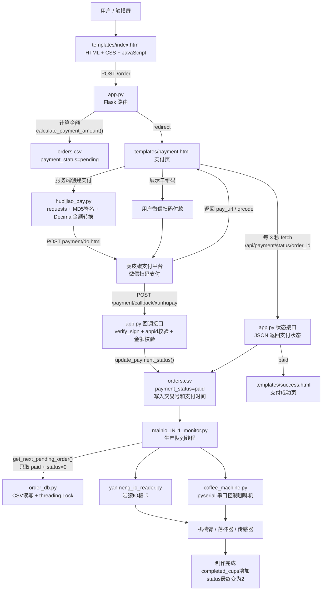

# Cursor_coffee
这个是cursor中开发coffee项目的github备份库

**项目介绍见 CLAUDE.md**

已改的程序

    1.虎皮椒id
    
    2.异常关闭先关闭连接

## 总览流程图

### 代码进化历程

这张图表达的是代码能力的递进关系：一开始只有“下单和制作”，后来加了“支付状态”作为制作门槛，最后把模拟支付入口替换为虎皮椒真实微信扫码支付。

### 一个订单的完整流程与技术栈

