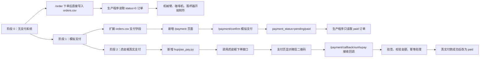
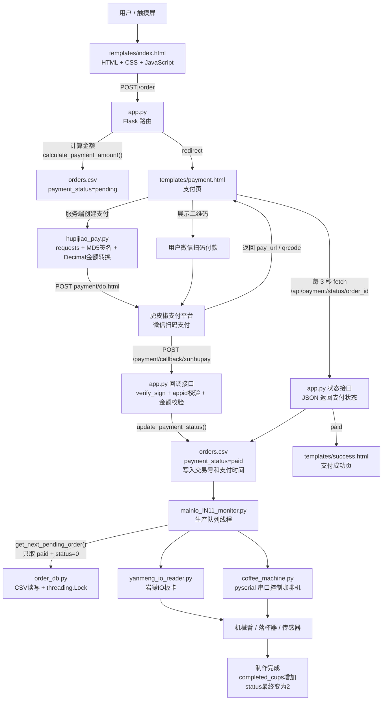
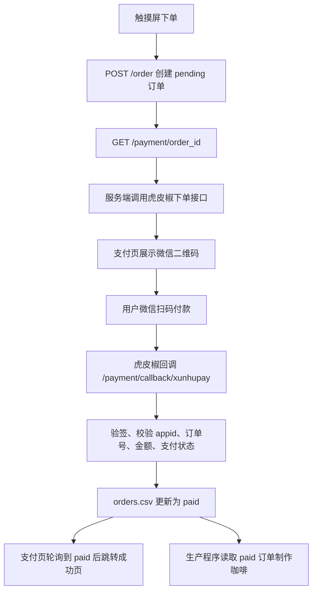

# 咖啡点单系统代码修改说明

本文档总结本项目从“没有支付系统”到“模拟支付”，再到“接入虎皮椒真实微信扫码支付”的代码演进过程，以及其中涉及的主要技术栈和设计思路。

## 总览流程图

### 代码进化历程



这张图表达的是代码能力的递进关系：一开始只有“下单和制作”，后来加了“支付状态”作为制作门槛，最后把模拟支付入口替换为虎皮椒真实微信扫码支付。

### 一个订单的完整流程与技术栈



这张图对应真实运行时的一笔订单：前端负责下单和展示二维码，Flask 负责业务路由和回调，`hupijiao_pay.py` 负责支付平台通信，`order_db.py` 用 CSV 保存订单状态，生产程序只消费已经真实支付成功的订单。

## 一、最初版本：没有支付系统

最初的咖啡点单系统核心目标是让触摸屏提交订单，然后由后台生产程序读取订单并驱动硬件制作咖啡。

### 原始业务流程

```text
触摸屏选择杯数
    ↓
Flask 接收 /order 请求
    ↓
订单写入 orders.csv
    ↓
页面跳转到下单成功
    ↓
生产程序读取待处理订单
    ↓
机械臂、咖啡机、落杯器执行制作流程
```

这一阶段的特点是：只要用户提交订单，订单就会直接进入制作队列，没有“付款成功后才能制作”的限制。

### 主要代码结构

- `app.py`：Flask Web 服务，负责首页、下单接口、成功页等。
- `order_db.py`：基于 `orders.csv` 的简易订单数据库。
- `mainio_IN11_monitor.py`：后台生产控制程序，轮询订单并启动制作流程。
- `coffee_machine.py`：通过串口控制咖啡机制作美式咖啡。
- `yanmeng_io_reader.py`：控制岩獴 IO 板卡，读取传感器输入和写入输出信号。
- `templates/index.html`：触摸屏点单页面。
- `templates/success.html`：下单成功页面。

### 原始订单数据

原始订单主要围绕制作状态设计：

| 字段 | 含义 |
| --- | --- |
| `order_id` | 订单号 |
| `cups` | 咖啡杯数 |
| `created_time` | 创建时间 |
| `status` | 制作状态，`0` 未处理，`1` 处理中，`2` 已完成 |
| `completed_cups` | 已完成杯数 |

后台制作程序通过 `status == 0` 查找待制作订单，因此原始版本中“下单”和“进入制作队列”是直接绑定的。

## 二、第一阶段改造：加入模拟支付

为了在接入真实支付前先跑通完整支付链路，项目先增加了模拟支付。模拟支付的作用是验证订单状态、页面跳转、支付轮询、生产队列过滤等逻辑是否正确。

### 改造后的业务流程

```text
触摸屏选择杯数
    ↓
POST /order 创建订单
    ↓
订单写入 orders.csv，payment_status = pending
    ↓
跳转到 /payment/<order_id>
    ↓
点击“确认模拟支付”
    ↓
POST /payment/confirm
    ↓
订单 payment_status 改为 paid
    ↓
成功页展示支付信息
    ↓
生产程序只读取 paid 的订单
```

### 数据层修改

`order_db.py` 在原有 CSV 字段基础上增加了支付字段：

| 字段 | 含义 |
| --- | --- |
| `payment_status` | 支付状态，常见值为 `pending`、`paid` |
| `payment_amount` | 支付金额，单位为分 |
| `payment_method` | 支付方式，例如 `simulated`、`xunhupay_wechat` |
| `payment_time` | 支付完成时间 |
| `payment_transaction_id` | 支付交易号 |

同时增加了这些关键方法：

- `update_payment_status()`：更新订单支付状态、支付方式、交易号和支付时间。
- `get_payment_status()`：供前端轮询支付状态。
- `get_order_by_id()`：支付页和成功页按订单号读取订单。
- `get_orders_by_payment_status()`：按支付状态查询订单。
- `_ensure_standard_fields()`：自动给旧版 `orders.csv` 补齐新字段，避免旧数据导致程序报错。

最关键的变化是：`get_pending_orders()` 和 `count_pending_cups()` 都增加了 `payment_status == 'paid'` 的过滤条件。也就是说，未支付订单即使已经写入 CSV，也不会被后台生产程序取走制作。

### Flask 路由修改

`app.py` 增加了支付相关逻辑：

- `/order`：不再直接跳成功页，而是创建 `pending` 订单后跳转到支付页。
- `/payment/<order_id>`：展示支付页面。
- `/payment/confirm`：模拟支付确认接口，把订单改为 `paid`。
- `/api/payment/status/<order_id>`：支付状态查询接口，供页面定时轮询。
- `/order/success`：增加校验，只有已支付订单才能进入成功页。

模拟支付使用 `generate_transaction_id()` 生成类似 `SIM-时间戳-随机串` 的交易号，用来模拟真实支付平台返回的交易流水。

### 前端页面修改

新增或改造了这些模板：

- `templates/payment.html`：展示订单号、杯数、金额、支付状态和模拟支付按钮。
- `templates/index.html`：按钮文案改为“提交订单并支付”，并增加防重复提交逻辑。
- `templates/success.html`：展示支付金额、支付方式、交易号、支付时间。

支付页通过 JavaScript 每 3 秒请求一次 `/api/payment/status/<order_id>`。当接口返回 `payment_status == 'paid'` 时，页面自动跳转到支付成功页。

## 三、第二阶段改造：接入虎皮椒真实微信扫码支付

在模拟支付流程验证完成后，项目进一步接入虎皮椒支付平台，实现真实微信扫码支付。用户下单后触摸屏显示真实微信支付二维码，用户扫码支付成功后，虎皮椒服务器异步回调本地 Flask 服务，服务端验签通过后才把订单改为 `paid`。

### 真实支付流程



### 新增虎皮椒支付模块

新增 `hupijiao_pay.py`，把虎皮椒示例代码整理成项目内可复用的支付客户端。它相比原始示例 `hupijiao-v3-python.py` 做了这些改造：

- 去掉示例代码中的 `import config`，改为从环境变量或 `.env` 读取配置。
- 封装 `HupijiaoConfig`，集中管理 `appid`、`appsecret`、公网回调地址、网关地址、支付方式等。
- 封装 `HupijiaoClient.create_payment()`，负责调用虎皮椒下单接口。
- 使用 `sign()` 生成虎皮椒要求的 MD5 签名。
- 使用 `verify_sign()` 校验虎皮椒回调签名。
- 使用 `parse_trade_order_id()` 从虎皮椒商户订单号中解析本地订单号。
- 使用 `Decimal` 处理金额元和分的转换，避免浮点误差。
- 支持用 `qrcode` 和 `Pillow` 把支付链接生成二维码 `data:image/png;base64,...`，便于直接在页面展示。

虎皮椒相关环境变量包括：

```env
XUNHUPAY_APPID=
XUNHUPAY_APPSECRET=
XUNHUPAY_PUBLIC_BASE_URL=
XUNHUPAY_GATEWAY=https://api.xunhupay.com/payment/do.html
XUNHUPAY_PAYMENT=wechat
XUNHUPAY_TITLE=领志科技咖啡
XUNHUPAY_TIMEOUT=15
```

其中 `XUNHUPAY_PUBLIC_BASE_URL` 必须是虎皮椒服务器能访问的公网 HTTPS 地址，例如 cpolar 提供的地址。触摸屏访问局域网地址可以正常点单，但支付平台异步回调不能访问局域网地址，所以真实支付必须准备公网回调地址。

### app.py 中的真实支付改造

`/payment/<order_id>` 从模拟支付页面升级为真实支付页面：

- 读取订单信息。
- 如果订单已经支付，直接跳转成功页。
- 如果未支付，则调用 `HupijiaoClient.create_payment(order)` 创建虎皮椒支付订单。
- 把 `pay_url`、`qr_image`、`qr_data_uri` 传给 `templates/payment.html`。
- 如果虎皮椒配置缺失或接口调用失败，在页面显示错误提示。

新增 `/payment/callback/xunhupay` 作为虎皮椒异步回调接口。这个接口不会收到回调就直接改订单，而是依次做校验：

1. 读取环境变量中的虎皮椒配置。
2. 使用 `verify_sign()` 校验回调签名。
3. 校验回调中的 `appid` 是否与本机配置一致。
4. 校验 `status == 'OD'`，确认虎皮椒表示订单已支付。
5. 从 `trade_order_id` 中解析本地订单号。
6. 查询本地订单是否存在。
7. 校验回调金额与本地订单金额一致。
8. 如果订单已经是 `paid`，直接返回 `success`，保证重复回调幂等。
9. 校验通过后调用 `order_db.update_payment_status(order_id, 'paid', 'xunhupay_wechat', transaction_id)`。
10. 返回纯文本 `success`，避免虎皮椒重复通知。

同时，模拟支付被收紧为开发调试功能：

```env
ENABLE_SIMULATED_PAYMENT=false
```

只有显式开启 `ENABLE_SIMULATED_PAYMENT` 时，`/payment/confirm` 才允许把订单改为已支付。正式使用时关闭这个开关，避免绕过真实付款。

### 支付页修改

`templates/payment.html` 从“模拟二维码 + 模拟支付按钮”改为“真实微信扫码支付二维码 + 状态轮询”：

- 优先展示虎皮椒返回的二维码图片地址。
- 如果虎皮椒只返回支付链接，则展示后端生成的 base64 二维码。
- 如果二维码生成失败，展示配置错误提示。
- 保留每 3 秒轮询 `/api/payment/status/<order_id>` 的逻辑。
- 当支付状态变为 `paid` 时自动跳转 `/order/success?order_id=...`。
- 开发模式下才显示“确认模拟支付”按钮。

### 成功页修改

`templates/success.html` 增加支付详情展示：

- 订单号
- 支付金额
- 支付方式
- 交易号
- 支付时间

`app.py` 中的 `payment_method_label()` 会把 `xunhupay_wechat` 显示为“微信扫码支付”，让页面对用户更友好。

## 四、生产系统与支付系统的关系

这次支付改造没有重写硬件生产流程，而是在订单层增加了“支付状态门禁”。

后台生产程序 `mainio_IN11_monitor.py` 仍然通过 `OrderDatabase` 获取待制作订单。真正改变的是 `order_db.py` 的查询逻辑：只有同时满足下面条件的订单才会进入制作队列：

```text
status == 0
payment_status == paid
```

这样做的好处是代码结构比较简单：

- Flask 负责下单、支付、回调、页面展示。
- CSV 继续作为订单状态存储。
- 生产程序继续按原来的方式轮询订单。
- 硬件控制代码不用理解支付平台，只关心“有没有已支付待制作订单”。

## 五、涉及的技术栈

### 后端

- Python：项目主语言。
- Flask：提供 Web 页面、下单接口、支付接口和回调接口。
- Jinja2：渲染 `templates/*.html` 页面。
- CSV 文件存储：使用 `orders.csv` 作为轻量订单数据库。
- `threading.Lock`：保护 CSV 读写和订单状态更新，减少并发写入冲突。
- `requests`：调用虎皮椒支付下单接口。
- `hashlib.md5`：按虎皮椒规则生成签名。
- `hmac.compare_digest`：安全比较回调签名。
- `Decimal`：处理支付金额转换，避免浮点数精度问题。
- `qrcode[pil]`、`Pillow`：把支付链接生成二维码图片。
- `base64`、`BytesIO`：把二维码图片转换为浏览器可直接显示的 data URI。

### 前端

- HTML + CSS：触摸屏点单页、支付页、成功页。
- JavaScript `fetch()`：轮询支付状态和待制作杯数。
- 定时器 `setInterval()`：定期刷新页面状态。
- 表单防重复提交：避免用户连续点击造成重复下单。

### 支付与部署

- 虎皮椒支付：作为微信扫码支付聚合平台。
- 微信扫码支付：用户实际使用微信扫码完成付款。
- 公网 HTTPS 回调：真实支付必须让虎皮椒服务器能访问 `/payment/callback/xunhupay`。
- cpolar：测试阶段可用于把本地 Flask 服务暴露成公网 HTTPS 地址。
- 环境变量 / `.env`：保存支付 AppID、密钥、公网地址等敏感配置，避免写死在代码中。

### 硬件控制

- `pyserial`：通过串口连接咖啡机。
- 岩獴 IO 板卡：控制机械臂、落杯器等外设信号。
- 多线程：后台生产系统中分离数据库监控、队列监控和单杯制作流程。
- 日志：使用 `logging` 写入 `Coffee_machine2.log`，记录生产状态和异常。

## 六、关键文件修改清单

| 文件 | 修改内容 |
| --- | --- |
| `app.py` | 增加支付金额计算、支付页、模拟支付确认、支付状态查询、虎皮椒回调、成功页支付校验 |
| `order_db.py` | 扩展 CSV 字段，增加支付状态读写方法，并让生产队列只读取已支付订单 |
| `hupijiao_pay.py` | 新增虎皮椒支付客户端，封装配置、签名、验签、下单、二维码生成 |
| `templates/index.html` | 首页下单按钮改为提交订单并支付，增加防重复提交和待制作杯数刷新 |
| `templates/payment.html` | 新增真实微信支付二维码展示、支付状态轮询、开发模式模拟支付入口 |
| `templates/success.html` | 支付成功后展示金额、方式、交易号和支付时间 |
| `requirements.txt` | 增加 `requests`、`qrcode[pil]`、`Pillow` 等支付和二维码依赖 |
| `.cursor/plans/hupijiao-payment_8edbc551.plan.md` | 记录虎皮椒真实支付接入计划和验收项 |
| `payment_implementation_plan_v2.md` | 记录模拟支付阶段和微信扫码支付方案设计 |

## 七、最终形成的完整链路

现在系统的完整链路是：

```text
用户在触摸屏选择杯数
    ↓
Flask 创建本地 pending 订单
    ↓
支付页调用虎皮椒创建微信扫码支付
    ↓
触摸屏显示真实二维码
    ↓
用户微信扫码付款
    ↓
虎皮椒异步回调 Flask
    ↓
Flask 验签、校验订单和金额
    ↓
orders.csv 中订单 payment_status 改为 paid
    ↓
支付页轮询发现已支付并跳转成功页
    ↓
后台生产程序读取 paid 订单
    ↓
机械臂、咖啡机、落杯器开始制作咖啡
```

这次改造的核心思想是：不让支付系统直接控制硬件，而是通过订单状态解耦。支付成功只负责把订单从 `pending` 改为 `paid`，生产系统继续只读取“已支付且待制作”的订单。这样既保留了原来的硬件控制代码，也让真实付款成为进入制作队列的必要条件。
